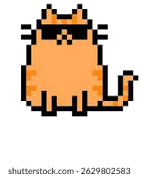

# cc-cat — One-Click Claude Code Launcher

A tiny floating cat that sits on your desktop. **Click it → Claude Code launches instantly.**

No start menu, no terminal typing. Just a cat. Click. Done.



## What it does

- Displays a floating cat image always on top of other windows
- One left-click opens Claude Code in a new terminal
- Drag the cat to reposition it anywhere on screen
- Right-click for menu (manual launch / exit)
- Transparent background — only the cat is visible, no ugly rectangle

## Requirements

| What | Why |
|---|---|
| **Windows** | Uses Windows-specific window layering for transparency |
| **Python 3.8+** | tkinter comes built-in with Python |
| **Pillow** | Image loading and alpha compositing (`pip install pillow`) |
| **Claude Code** | Must be installed and available in PATH (`claude` command) |

## Installation

```bash
# 1. Clone the repo
git clone https://github.com/1261251607/cc-quikstart.git
cd cc-quikstart

# 2. Install Python dependency
pip install pillow

# 3. Launch
pythonw cc_cat.py
```

Or just double-click `start_cccat.bat` (English) / `启动悬浮窗.bat` (Chinese).

### Optional: create a desktop shortcut with the cat icon

1. Right-click `start_cccat.bat` → Create shortcut
2. Right-click the shortcut → Properties → Change Icon
3. Browse to `cat.ico` in the repo folder
4. Move the shortcut to your desktop

### Optional: auto-start with Windows

1. Press `Win + R`, type `shell:startup`, Enter
2. Copy the shortcut into the Startup folder

## How it works

- **tkinter** creates a borderless, always-on-top window
- **Pillow** loads the cat PNG with alpha channel and composites it onto a magenta background
- `-transparentcolor "magenta"` tells Windows to make magenta pixels invisible → only the cat shows
- Left-click with < 5px movement → launch; > 5px movement → drag

## Customize the image

Replace `images.jpg` with your own image, then run:

```bash
python setup_image.py
```

This auto-crops white borders and flood-fills the background with transparency, producing a new `cat_icon.png`.

## Files

| File | Purpose |
|---|---|
| `cc_cat.py` | Main floating widget |
| `cat_icon.png` | Processed cat image (transparent background) |
| `images.jpg` | Original source image |
| `cat.ico` | Windows icon for shortcuts |
| `setup_image.py` | Image processing utility |
| `start_cccat.bat` / `启动悬浮窗.bat` | Double-click launchers |
